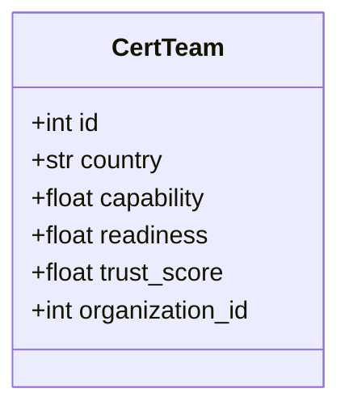

# National CERT Operations Guide

This module manages registration, performance tracking, and synchronization for sovereign Computer Emergency Response Teams (CERTs).

## Features

- **Country Registration:** Track and benchmark nation-state cyber defenses.
- **Capability Assessments:** Score capabilities in real-time.
- **Federated Synchronization:** Boost operational readiness via cross-border security drills.

## Database Schema



## Sample Code

```python
from app.services.cert_service import CertService

# Register a team
cert_team = CertService.register("Switzerland", 0.9, org_id=1)

# Evaluate Switzerland's preparedness
evaluation = CertService.evaluate(cert_team.id)
print(evaluation["rating"]) # Output: 'excellent', 'good', or 'needs_improvement'
```
