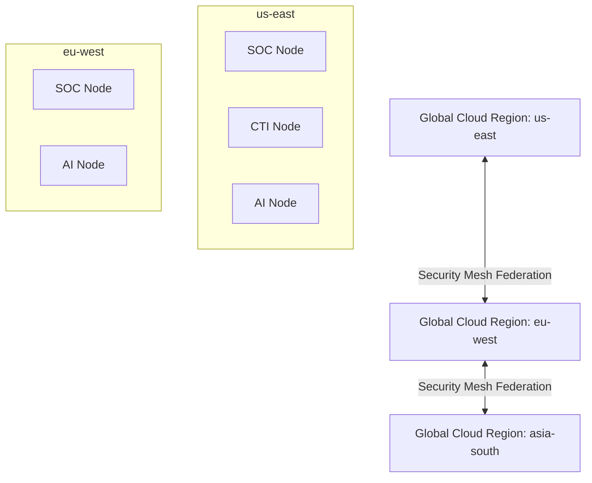

# Global Cyber Security Cloud Architecture

This document describes the design and topology of the multi-region Global Cyber Security Cloud offering cross-region node routing, security mesh federation, distributed AI coordination, threat reputation ranks, and organization resilience scores.

## Architecture Topology

## Core Models

### CloudRegion
- Tracks geographical cloud regions registry.
- Fields: `name`, `slug`, `region_code`, `status`, `location`.

### CloudNode
- Tracks specific node instances running regional roles.
- Fields: `region_id`, `name`, `node_type` (SOC Node, CTI Node, AI Node, Training Node), `status` (online, degraded, offline).

### CloudService
- Tracks deployed service instances and status mappings.
- Fields: `name`, `service_type` (SOC, CTI, LMS, SIEM), `status` (running, paused, maintenance).

## REST API Endpoints

- `GET /api/v1/cloud` - Retrieve regions, nodes, and services.
- `POST /api/v1/cloud/region` - Register new geographical region.
- `POST /api/v1/cloud/node` - Provision a regional node instance.
- `POST /api/v1/cloud/service` - Define a service mapping instance.
- `POST /api/v1/cloud/sync` - Trigger global configuration sync across regions.
