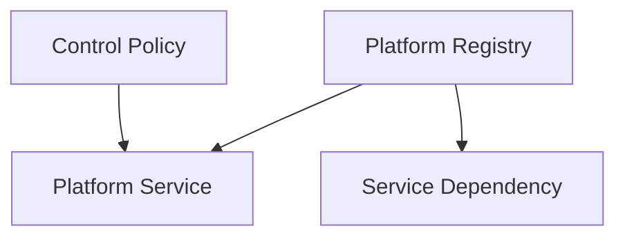

# Cyber Platform Control Plane Guide

The **Cyber Platform Control Plane** provides centralized service discovery, dependency tracking, health status updates, and AI governance monitoring.

## Architecture

## Service Discovery APIs

- Register service: `POST /api/v1/control-plane/services`
- Query dependencies status map: `GET /api/v1/control-plane/dependencies`
- Retrieve services summary: `GET /api/v1/control-plane/services`
