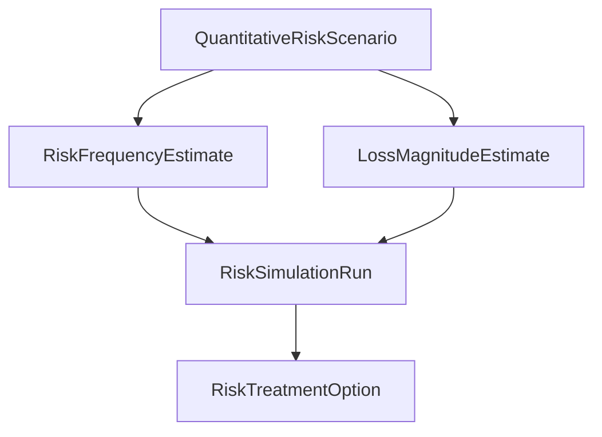

# Cyber Risk Quantification Architecture

This guide describes the architecture and quantitative cyber risk quantification methodology. All calculations are performed completely offline in simulated modes.

## Architecture

## Methodology

1. **Risk Scenarios**: Represents potential security threat incidents linked to critical business processes.
2. **Inherent Risk Score**: Computed as the product of the average likelihood score and average loss impact score.
3. **Tenant Boundary Control**: Enforced using strict `TenantMixin` and JWT authorization checks on all REST endpoints.
