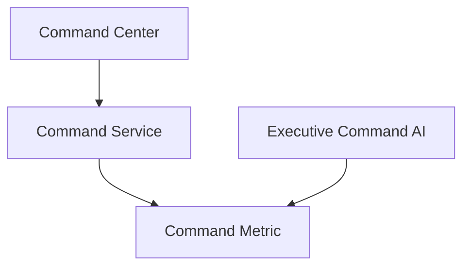

# Global Cyber Command Center Guide

The **Global Cyber Command Center** acts as the primary operations dashboard and management console for coordinated cyber operations, regional command centers, and real-time crisis room response tracking.

## Architecture

The Command Center aggregates operational parameters across multiple geographic locations.



## Setup & Configuration

Command centers are initialized per organization with a commander, region, and readiness score:

```python
from app.models.command_center import CommandCenter
from app.extensions import db

center = CommandCenter(
    region="North America",
    commander="General John Doe",
    readiness=0.85,
    organization_id=1
)
db.session.add(center)
db.session.commit()
```

## Executive Command AI

An AI decision-support engine provides automated recommendations based on weakest performance indices.

### Example Advice Query:
```python
from app.services.executive_command_ai import ExecutiveCommandAI
advice = ExecutiveCommandAI.advise("crisis")
print(advice)
```
