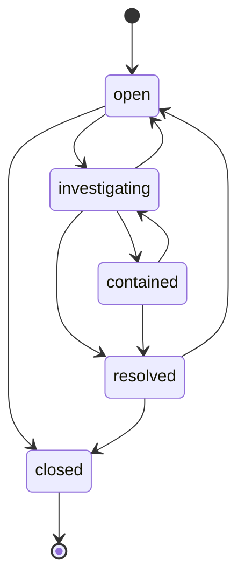

# Incident Management & SOAR Playbooks

This document outlines the incident response workflows and Security Orchestration, Automation, and Response (SOAR) playbooks.

---

## 1. Case Lifecycle (NIST Framework)
Cases represent active security incident investigations. The status transitions follow a strict state machine to maintain compliance with NIST incident response standards:

### Case States
- **Open**: Newly created case, unassigned or pending triage.
- **Investigating**: Assigned to analyst, diagnostic collection in progress.
- **Contained**: Host isolated or user session revoked. Threat is isolated.
- **Resolved**: Root cause analyzed, cleanup complete.
- **Closed**: Completed case documentation.

---

## 2. SOAR Playbooks
SOAR playbooks run automated response actions based on case escalation. All playbooks run in **simulation-only mode** to prevent modifications to live hypervisors or identity providers.

### Executable Playbooks
1. **Isolate Host**: Simulates isolation of infected endpoints at the EDR agent level. Logged to the case timeline.
2. **Disable User**: Simulates disabling accounts at the Identity Provider (IdP) level to prevent threat progression.
3. **Block IOC**: Marks malicious IPs, domains, or URLs as blacklisted in the threat intelligence DB.
4. **Create Incident**: Upgrades standard alerts into formal incident response tracking cases.
5. **Notify Analyst**: Simulates notification dispatches (Slack, Teams, Email) for high-priority incidents.
