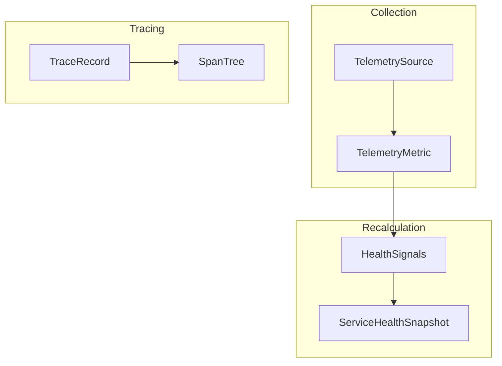

# Cyber Platform Observability Fabric

The **Observability Fabric** provides continuous telemetry collection, service health monitoring, and system tracing over all capability layers.

## Architecture

The Observability Fabric consists of a **Telemetry Collection Layer** that receives metric payloads, a **Tracing Layer** to correlate transaction spans, and a **Health Service** that evaluates capability health scores based on Golden Signals.

## Data Model

### TelemetrySource
Represents a simulated metric or trace log exporter:
- `id`: Unique identifier.
- `name`: Human-readable source name.
- `source_type`: `agent`, `metric_collector`, or `trace_collector`.
- `status`: `active`, `inactive`, or `degraded`.

### TelemetryMetric
Stores individual telemetry readings:
- `metric_name`: Indexed identifier (e.g. `latency`).
- `metric_value`: Normalized float value.
- `recorded_at`: Time series timestamp.

## REST APIs

### GET `/api/v1/operations-fabric/telemetry`
Lists all telemetry sources for a tenant.

### POST `/api/v1/operations-fabric/telemetry`
Ingests a telemetry reading or registers a source.

### GET `/api/v1/operations-fabric/traces`
Lists trace spans for active transactions.
