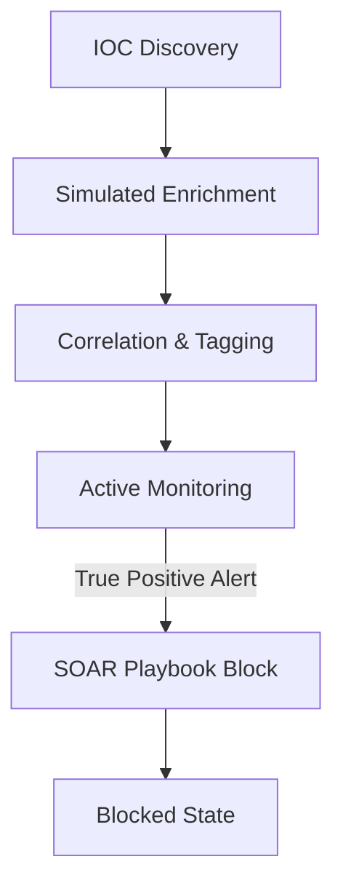

# Threat Intelligence Platform

Welcome to the CTF Arena Threat Intelligence Platform module guide. This system acts as a central repository for collecting, managing, enriching, and correlating Indicators of Compromise (IOCs).

---

## 1. IOC Types
The platform supports five core Indicator of Compromise (IOC) types:
1. **IP**: IPv4/IPv6 addresses (e.g., `198.51.100.42`)
2. **Domain**: Fully Qualified Domain Names (e.g., `malicious-c2.net`)
3. **URL**: Uniform Resource Locators (e.g., `http://malicious-c2.net/payload.exe`)
4. **Hash**: MD5, SHA-1, or SHA-256 file hashes
5. **Email**: Threat actor or phishing source email addresses

---

## 2. IOC Life Cycle

- **Discovery**: Indicators are ingested via open source/ISAC threat feeds or created manually by security analysts.
- **Enrichment**: The platform performs simulated metadata resolution (GeoIP country lookup and reputation scoring) to evaluate the indicator's context.
- **Correlation**: Identifies related indicators that originate from identical campaigns or threat actors.
- **Blocked State**: Simulates perimeter blacklisting by marking indicators as `is_blocked = True`.

---

## 3. Threat Feed Aggregation
Threat feeds automate the collection of indicators. The mock feed aggregator simulates daily fetching from external OSINT sources (e.g., AlienVault OTX, Abuse.ch URLHaus) and inserts synthetic threat records into the database for incident analysis.
No external network connections are made; the process runs fully sandboxed inside the database.
