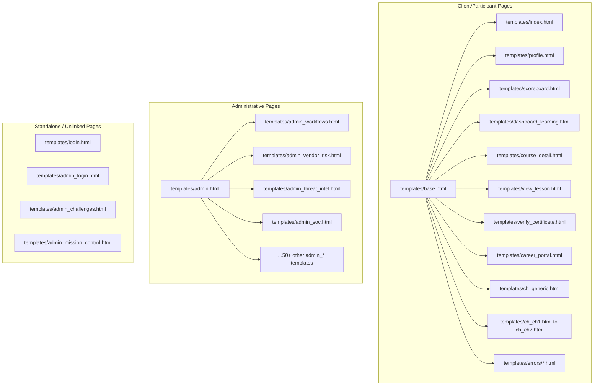

# Cyber Defense Platform — Frontend Structure Audit

This document presents the detailed architectural and structural audit of the current frontend codebase of the Cyber Defense Platform (CDP) for Stage 1 of the Cyber Defense Platform UI Modernization Directive.

---

## 1. Template Inheritance Tree & Layout Structure

The platform uses Flask with Jinja2 for server-side rendering. There is no frontend node-based build system (Vite/Webpack). All pages are server-rendered HTML.

### 1.1 Inheritance Hierarchy

### 1.2 Layout & Block Analysis
- **`templates/base.html`**: Shared layout for participants. It defines `` and `` and injects user session details.
- **`templates/admin.html`**: Acts as a **hybrid template**:
  1. It defines the shell layout (header navigation, meta tags, and global CSS/JS variables) for administrative sub-pages extending it.
  2. Inside its default ``, it directly embeds the markup and logic for the **Main Admin Dashboard**. Sub-pages override this block, replacing the dashboard elements with their page-specific tables/forms.
  3. **Critical Defect**: The javascript logic (Chart.js initialization and 1-second auto-update poll) is placed at the bottom of the file *outside* the `` block. As a result, when sub-pages extend `admin.html`, this script is still executed. It will fail with a `TypeError` when it attempts to look up `#scoreChart` or `#leaderboard-body` unless protected by safe guard checks.
- **Standalone Layouts**: Pages like `admin_challenges.html`, `admin_mission_control.html`, `login.html`, and `admin_login.html` do not extend any base layout. They copy-paste the head section, CSS stylesheets, and navigation markup completely.

---

## 2. Style Duplication & Asset Delivery

### 2.1 CSS Delivery
- **No External Stylesheets**: The `static/` directory does not contain any CSS files.
- **Inline `<style>` Blocks**: Styling is fully declared inline within `<style>` tags in the `<head>` of individual templates.
- **Accidental Theme Re-declarations**: Variables like `--bg`, `--surface`, `--neon-blue`, `--text`, and `--muted` are duplicated in almost every file, leading to drift in hex values (e.g., `#0b0c10` in `admin.html` vs `#0a0f1e` in `admin_mission_control.html`).

### 2.2 Navigation & Markup Duplication
- **Header Navigation**: Navigation headers are duplicated across:
  - `templates/admin.html`
  - `templates/admin_challenges.html`
  - `templates/admin_login.html`
- Changes to navigation links or badges must currently be synchronized across multiple raw HTML fragments.

---

## 3. JavaScript & Chart Libraries

- **Libraries Used**: `Chart.js` (loaded via CDN: `https://cdn.jsdelivr.net/npm/chart.js@4.4.0/dist/chart.umd.min.js`).
- **Inline Scripts**: Real-time pollers, fetch updates, chart renders, and delete confirmation dialogs are completely inlined in individual script tags.
- **State Serialization**: Python structures are passed directly into JS using the `|tojson` Jinja filter (e.g., `const initialScores = {{ leaderboard | map(attribute='score') | list | tojson }};`).

---

## 4. CSRF, Forms, & Context Processors

### 4.1 Flask-WTF / CSRF Guard
All forms require CSRF tokens when POST requests are processed:
- **HTML forms**: `<input type="hidden" name="csrf_token" value="{{ csrf_token() }}">`
- **AJAX requests (e.g. data reset)**: Handled via fetch request headers: `'X-CSRFToken': '{{ csrf_token() }}'`.

### 4.2 Context Processors
`app/context_processors.py` injects several variables globally:
- `stats` (default stats block for admin dashboard).
- `leaderboard` (live participant ranks).
- `challenges` (active list of registered challenges).
- `username` / `current_user_name`.
- `platform_name` ("CTF Arena").

---

## 5. Critical DOM Selectors to Preserve

To ensure compatibility with existing regression tests and scripts, the following DOM identifiers and attributes **must remain unchanged**:

| Template | Element Description | Selector / ID | Type |
|---|---|---|---|
| **`admin_login.html`** | Login Form | `id="admin-login-form"` | `<form>` |
| | Username Input | `id="admin-username"` | `<input>` |
| | Password Input | `id="admin-password"` | `<input>` |
| | Login Button | `id="btn-admin-login"` | `<button>` |
| | Back Link | `id="link-back-register"` | `<a>` |
| **`login.html`** | Login Form | `id="login-form"` | `<form>` |
| | Username Input | `id="login-username"` | `<input>` |
| | Password Input | `id="login-password"` | `<input>` |
| | Remember Me | `id="login-remember"` | `<input type="checkbox">` |
| | Submit Button | `id="btn-login-submit"` | `<button>` |
| | Registration Link | `id="link-register"` | `<a>` |
| | Admin Login Link | `id="link-admin-login"` | `<a>` |
| **`admin.html`** | Brand Link | `id="brand-admin-link"` | `<a>` |
| | Navigation: Dashboard | `id="nav-dashboard"` | `<a>` |
| | Navigation: Challenges | `id="nav-challenges"` | `<a>` |
| | Navigation: Categories | `id="nav-categories"` | `<a>` |
| | Navigation: Announcements | `id="nav-announcements"` | `<a>` |
| | Navigation: Submissions | `id="nav-submissions"` | `<a>` |
| | Navigation: Competition | `id="nav-competition"` | `<a>` |
| | Navigation: Live Stats | `id="nav-stats"` | `<a>` |
| | Present Scoreboard | `id="btn-public-scoreboard"` | `<a>` |
| | Last Refresh Text | `id="last-refresh-text"` | `` |
| | Reset All Button | `id="btn-reset-all"` | `<button>` |
| | Logout Link | `id="btn-admin-logout"` | `<a>` |
| | Participant Count | `id="stat-participants"` | `
` |
| | Solves Count | `id="stat-solves"` | `
` |
| | Popular Challenge | `id="stat-popular"` | `
` |
| | Max Points | `id="stat-maxpts"` | `
` |
| | Score Chart Canvas | `id="scoreChart"` | `<canvas>` |
| | Challenge Completion List | `id="ch-solve-bars"` | `
` |
| | Challenge Bar Row | `id="bar-row-[ch_id]"` | `
` |
| | Leaderboard Table | `id="leaderboard-table"` | `<table>` |
| | Leaderboard Body | `id="leaderboard-body"` | `<tbody>` |
| | Leaderboard Entry Row | `id="row-[index]"` | `<tr>` |

---

## 6. Layout Weaknesses & UX Issues

1. **Inline Script Crashes**: Child pages extending `admin.html` crash in the browser console when trying to render the non-existent `scoreChart` canvas.
2. **Visual Drift**: Non-standard CSS variables across templates cause visual variance in dark mode backgrounds.
3. **No Mobile Sidebar / Menu**: Headers overflow on small viewport displays; no collapsible menu triggers.
4. **Contrast**: Accent colors on input focus and secondary muted elements have insufficient contrast against deep navy panels.
5. **No Layout Uniformity**: Main admin dashboard, Mission Control, and login forms follow differing spacing, border radiuses, and grid configurations.
