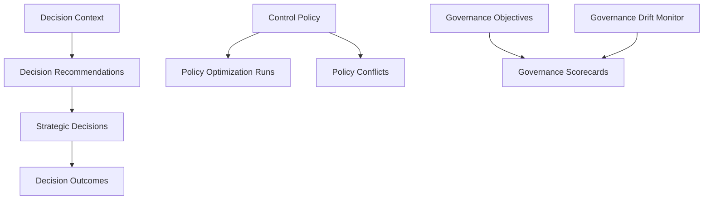

# Phase 38 — Enterprise Security Decision Intelligence, Adaptive Policy Optimization & Governance Fabric

This documentation covers the integration, capabilities, models, and usage of the Enterprise Governance Intelligence fabric introduced in Phase 38.

## Overview

The Enterprise Governance Intelligence fabric coordinates and verifies the strategic alignment of cyber-risk portfolios, control policies, and operational objectives. It leverages simulation-based modeling, policy conflict checking, objective progress metrics, composite scorecards, and governance drift detection.

---

## Architectural Components



### 1. Decision Intelligence Contexts
Captures operational parameters across:
* **Context types**: `risk`, `resilience`, `compliance`, `architecture`, `operations`, `investment`, `trust`, `incident`
* **Signals tracked**: `risk_score`, `resilience_score`, `control_effectiveness_score`, `evidence_confidence_score`, `urgency_score`

### 2. Adaptive Policy Optimization
Simulates changes to policy configuration parameters offline without touching active infrastructure:
* **Run modes**: `threshold_tuning`, `parameter_search`
* **Reproducibility**: Explicit random seed control for repeatable simulations.
* **Constraints**: Verification checks against maximum acceptable risk thresholds.

### 3. Policy Conflict Detector
Identifies logical contradictions, scope overlaps, priority inversions, and enforcement mode mismatches across active control policies:
* **Types of conflict**: `contradiction`, `enforcement_conflict`, `scope_overlap`
* **Resolution workflows**: Transitions conflict records through `open` -> `reviewing` -> `resolved` based on human verification.

### 4. Governance Scorecards
Calculates a weighted average metric representing the organization's composite security posture.
Default weights mapping:
* **Risk Alignment**: 25%
* **Policy Effectiveness**: 20%
* **Evidence Quality**: 15%
* **Decision Quality**: 20%
* **Objective Progress**: 20%

### 5. Governance Drift Monitor
Checks for systemic deviations between actual metrics and baseline boundaries:
* **Risk Appetite Drift**: Flags when residual risk scores breach maximum limits.
* **Control Coverage Drift**: Alerts when average coverage drops below the baseline threshold.

---

## Integration Endpoints

All endpoints are prefix-matched under `/api/v1/governance-intelligence/`:
* `GET  /api/v1/governance-intelligence/contexts` - List decision contexts
* `POST /api/v1/governance-intelligence/contexts` - Create decision context
* `POST /api/v1/governance-intelligence/contexts/<id>/recommend` - Generate decision recommendations
* `POST /api/v1/governance-intelligence/policies/<id>/optimize` - Trigger policy optimization simulation
* `GET  /api/v1/governance-intelligence/conflicts` - Auto-detect and list active policy conflicts
* `POST /api/v1/governance-intelligence/conflicts/<id>/resolve` - Apply resolution status
* `GET  /api/v1/governance-intelligence/scorecards` - Get scorecard measurements
* `POST /api/v1/governance-intelligence/scorecards/calculate` - Recompute and save composite scores
* `GET  /api/v1/governance-intelligence/drift` - Check active governance drift alerts
* `GET  /api/v1/governance-intelligence/brief` - Fetch executive C-level governance brief generated by AI

---

## Verification & Testing

Verify implementation via the specialized pytest suite:
```bash
python -m pytest tests/test_decision_intelligence.py tests/test_policy_optimization.py tests/test_policy_conflicts.py tests/test_governance_objectives.py tests/test_governance_scorecards.py tests/test_decision_outcomes.py tests/test_governance_drift.py tests/test_governance_api.py tests/test_executive_governance_ai.py
```
Total Phase 38 tests verified: **88 test cases** (All passing).
